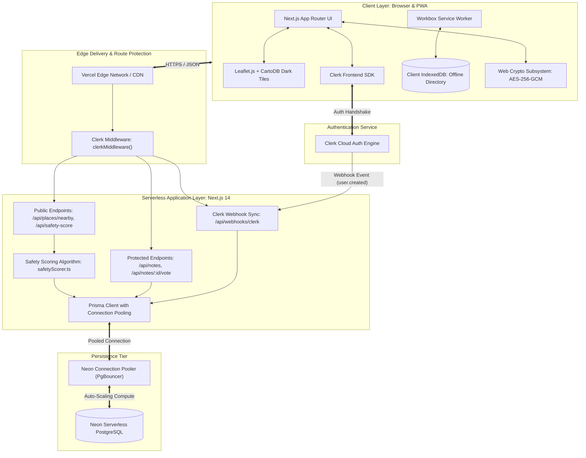
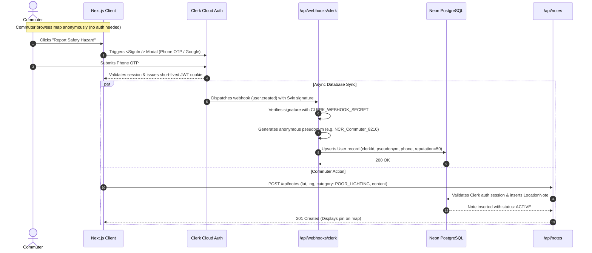
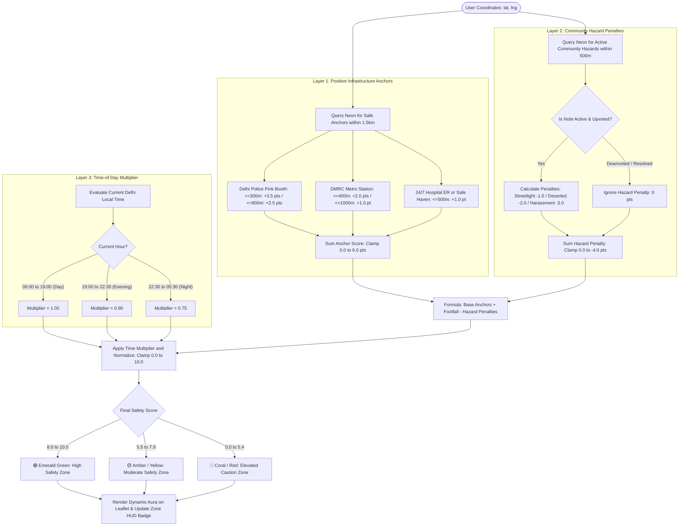
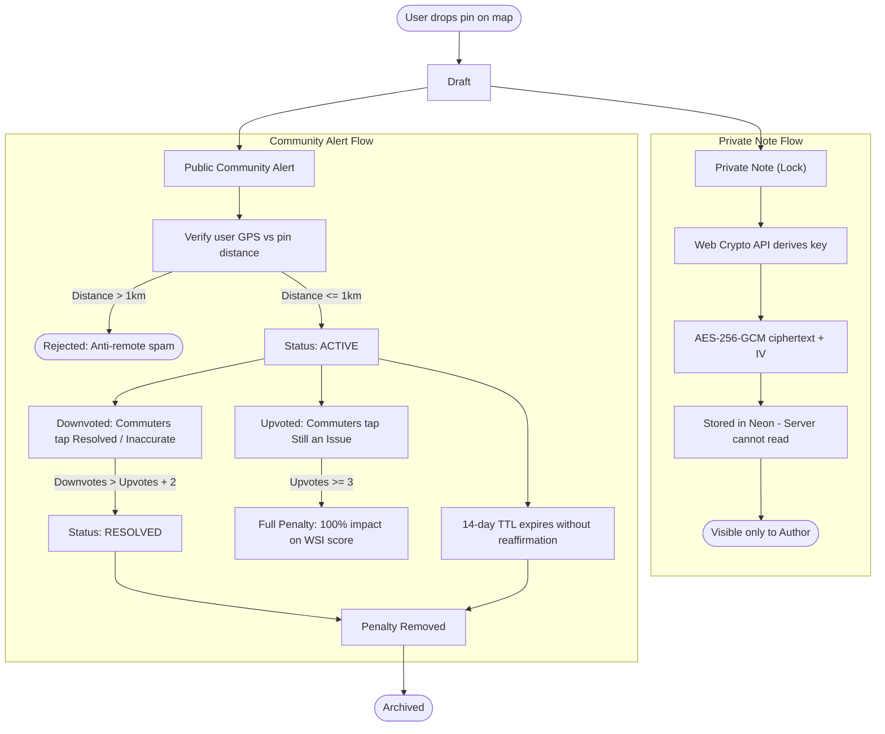
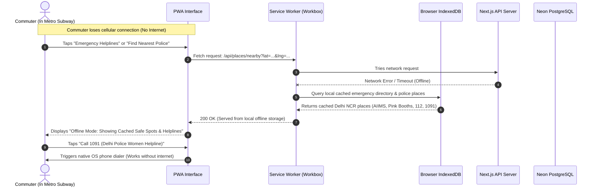
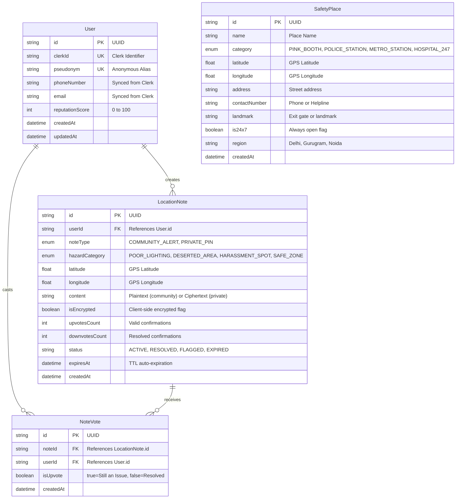
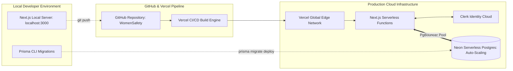

# SafeCity Delhi NCR: Technical Architecture Blueprint
## Comprehensive Architecture, Flowcharts & Engineering Specifications

---

## 1. Architectural Overview & Design Principles

SafeCity Delhi NCR is built as an **offline-resilient, full-stack monolithic Progressive Web Application (PWA)**. The system eliminates infrastructure friction by relying on managed, autoscaling cloud services:

1. **Monolithic Simplicity:** Next.js 14+ (App Router) hosts the React frontend UI, PWA Service Worker, and serverless API route handlers in **one repository**.
2. **Zero-API-Key Mapping:** Leaflet.js with CartoDB Dark Matter / OpenStreetMap tiles eliminates third-party tile subscription costs and telemetry locks.
3. **Serverless Persistence:** Neon PostgreSQL provides serverless compute with built-in connection pooling (`PgBouncer`) and instant point-in-time recovery.
4. **Managed Identity:** Clerk (`@clerk/nextjs`) manages SMS OTP, WhatsApp verification, and session cookies, synchronized to Neon via webhooks.
5. **Zero-Knowledge Privacy:** Private safety notes are encrypted in the client browser using the Web Crypto API (`AES-256-GCM`) before transmission to the database.

---

## 2. End-to-End System Architecture



---

## 3. Clerk Authentication & Neon Database Sync Flow

To safeguard user privacy while preventing spam, public browsing of the map and emergency services requires **zero login**. Only users posting community alerts or saving private pins are authenticated via Clerk.



---

## 4. Safety Heatmap Engine Calculation & Visualization

The Safety Heatmap determines how safe any geographic area in Delhi NCR is using a 3-layer quantitative evaluation:



---

## 5. Location Notes Lifecycle & Anti-Misinformation State Machine

To prevent misinformation, trolling, or outdated reviews from permanently skewing Delhi NCR neighborhood ratings, notes transition through a deterministic lifecycle:



---

## 6. Offline-First Emergency Fallback Sequence

During subway transit or cellular dead zones, the Progressive Web App guarantees 100% uptime for life-saving emergency helplines and nearest police coordinates:



---

## 7. Database Architecture & Schema Specification

The database utilizes **Neon Serverless PostgreSQL** via **Prisma ORM**.



### High-Performance Haversine Distance Query (SQL)
To find the closest police stations and Pink Booths within $3\text{ km}$, Prisma executes an indexed SQL mathematical query:

```sql
SELECT 
    id, name, category, latitude, longitude, address,
    contact_number AS "contactNumber", landmark,
    (6371 * acos(
        cos(radians(:userLat)) * cos(radians(latitude)) * 
        cos(radians(longitude) - radians(:userLng)) + 
        sin(radians(:userLat)) * sin(radians(latitude))
    )) AS distance_km
FROM "SafetyPlace"
WHERE 
    latitude BETWEEN (:userLat - 0.035) AND (:userLat + 0.035)
    AND longitude BETWEEN (:userLng - 0.035) AND (:userLng + 0.035)
ORDER BY distance_km ASC
LIMIT 20;
```

---

## 8. Client-Side Zero-Knowledge Encryption Flow

To ensure absolute user privacy for private notes (e.g. *"Spare bike key kept near metro pillar"*, *"Alley behind market is dark after 10 PM"*), notes are protected by a **Zero-Knowledge Web Crypto Architecture**:

```
+-------------------------------------------------------------------------------+
| CLIENT BROWSER (Web Crypto API)                                               |
|                                                                               |
| 1. User Master Passphrase                                                     |
|         + Client Device Salt                                                  |
|         |                                                                     |
|         v (PBKDF2-HMAC-SHA256, 100,000 Iterations)                            |
|    Derived 256-bit AES-GCM Key (in browser RAM only, never sent to server)     |
|         |                                                                     |
| 2. Raw Private Note: "Scooter parked at Gate 4 near camera"                   |
|         |                                                                     |
|         v (crypto.subtle.encrypt: AES-256-GCM + 96-bit random IV)             |
|    Ciphertext: "3f8b01c...99a", IV: "a1b2c3d4e5f6"                            |
+-------------------------------------------------------------------------------+
                                       |
                   Encrypted JSON payload over TLS 1.3
                                       |
                                       v
+-------------------------------------------------------------------------------+
| NEON POSTGRESQL DATABASE                                                      |
|                                                                               |
| Stores: { id, userId, lat, lng, content: "3f8b01c...99a", isEncrypted: true } |
|                                                                               |
| Database administrators and hackers CANNOT decrypt the plaintext note!       |
+-------------------------------------------------------------------------------+
```

---

## 9. Security, Privacy & Differential Anonymity Guardrails

1. **Identity Pseudonymization:**
   - Public community notes display pseudonyms (`NCR_Commuter_4819`).
   - The user's real name, phone number, and email are never exposed to other commuters or returned in public API payloads.
2. **Anti-Stalking Telemetry Protection:**
   - SafeCity **never stores persistent user GPS breadcrumbs** or location histories.
   - GPS telemetry sent for safety calculations is processed ephemerally in-memory and discarded.
3. **Anti-Brigading & Sybil Resistance:**
   - A commuter must be within **$1\text{ km}$** of the reported coordinates to submit an alert.
   - IP and user-rate limits prevent malicious coordinated review-bombing of commercial areas.
4. **Emergency Stealth Trigger:**
   - Triple-tapping the header logo activates a **Stealth Calculator Disguise**, disguising the screen as a normal calculator while preserving silent background emergency broadcasting.

---

## 10. Deployment Topology & Production Pipeline



---

## 11. Architectural Summary & Verification Milestones
- [x] **Lightweight & Free:** Zero paid mapping subscriptions (Leaflet + CartoDB Dark Matter).
- [x] **Scalable Serverless Backend:** Next.js monolithic API + Neon autoscaling Postgres with PgBouncer.
- [x] **Frictionless Auth:** Clerk SMS/WhatsApp OTP with zero login required for emergency map features.
- [x] **Transparent Safety Heatmap:** Multi-factor scoring model combining verified anchors, time of day, and verified community hazard alerts.
- [x] **Crisis Resilient:** 100% offline emergency telephone directory and cached safe locations.
