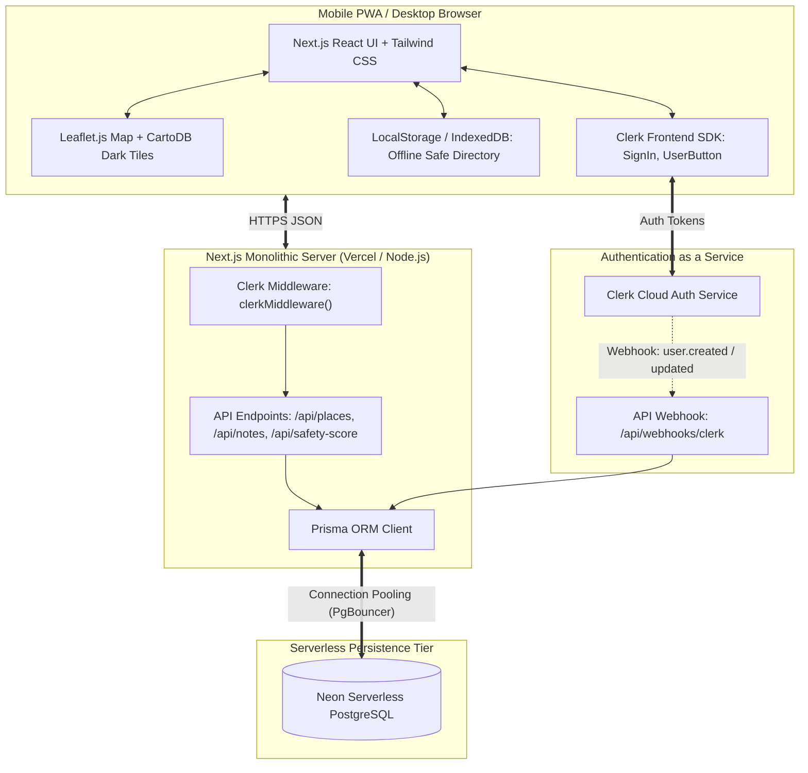

# SafeCity Delhi NCR: Simplified PRD & Technical Architecture Blueprint
## Pragmatic, Fast-to-Deploy Women's Safety & Navigation Web App

---

## 1. Product Overview: The Delhi NCR Context

### 1.1 Problem Statement & Regional Scope
Navigating the **National Capital Region (Delhi, Gurugram, Noida, Faridabad, Ghaziabad)** after dark presents unique safety challenges:
- Inconsistent street lighting across transit access roads and last-mile connectivity corridors.
- Disconnected jurisdictional helplines across state borders (Delhi Police vs. Haryana Police in Gurugram vs. UP Police in Noida/Ghaziabad).
- Fragmented transit transfers (Delhi Metro DMRC, DTC buses, auto-rickshaw/e-rickshaw stands).
- Commuters frequently lack instant, offline-accessible visibility into verified safe spots (Delhi Police **Pink Booths**, 24/7 hospital emergency rooms, and active commercial areas).

### 1.2 The "Keep It Simple & Actionable" Philosophy
Rather than building an over-engineered enterprise microservices system with complex vector tile pipelines, this blueprint focuses on a **pragmatic, single-codebase monolithic PWA**:
- **Zero API Keys Required for Mapping:** Uses Leaflet.js with free OpenStreetMap / CartoDB Dark Matter tiles.
- **Serverless PostgreSQL via Neon:** Instant, serverless Postgres with branching and connection pooling.
- **Managed Authentication via Clerk:** Seamless SMS OTP, WhatsApp, Google OAuth, and session management with zero auth boilerplate.
- **Single Tech Stack:** Next.js 14+ (App Router) handles the frontend UI, mobile PWA shell, and backend API routes in **one unified codebase**.
- **Curated Delhi NCR Seed Data:** Out-of-the-box verified police stations, Pink Booths, DMRC metro stations, and 24/7 hospitals.

---

## 2. Delhi NCR Specific Emergency & Infrastructure Matrix

### 2.1 Unified Emergency Helpline Directory (Click-to-Call)
The application embeds a one-tap emergency directory that automatically identifies local jurisdiction:

| Authority / Agency | Helpline Number | Jurisdictional Coverage | Availability |
| :--- | :--- | :--- | :--- |
| **National Emergency Number** | `112` | All India (Delhi, Haryana, UP) | 24/7 |
| **Delhi Police Women Helpline** | `1091` | National Capital Territory of Delhi | 24/7 |
| **Delhi Commission for Women (DCW)** | `181` | NCT of Delhi | 24/7 |
| **UP Women Powerline** | `1090` | Noida, Greater Noida, Ghaziabad | 24/7 |
| **Haryana Women Helpline** | `1091` | Gurugram, Faridabad | 24/7 |
| **Delhi Metro (DMRC) Helpline** | `155370` / `011-23469500` | All DMRC Metro Stations & Lines | Operational Metro Hours |
| **Student / DU Anti-Ragging Helpline** | `1800-180-5522` | North & South University Campus | 24/7 |

### 2.2 Local Safe Infrastructure Types
1. **Delhi Police Pink Booths ("Gulabi Booths"):** Dedicated police kiosks staffed by female officers located at high-footfall transit gates, markets, and university zones (e.g., Janpath, Karol Bagh, Laxmi Nagar, Rohini, DU North Campus).
2. **DMRC Metro Stations:** Naturally safe transit islands with CISF armed security, female-only first coaches, and well-lit entry/exit gates.
3. **24/7 Hospital ERs:** AIIMS (Ansari Nagar), Safdarjung Hospital, RML Hospital, LNJP, Fortis Memorial (Gurugram), Max Healthcare (Saket/Patparganj), and Kailash Hospital (Noida).
4. **Vetted Commercial Safe Havens:** 24/7 convenience stores (e.g., 24 Seven, Needs Supermarket), 24-hour petrol pumps (HP/IOCL/BPCL with active lighting and attendants).

---

## 3. How the Safety Heatmap Works (Scoring & Visualization)

A core question for urban safety is: **How do we determine which area is how safe, and how is that visually shown to a commuter?**

```
+-------------------------------------------------------------------------------+
|                      COMPOSITE SAFETY SCORE FORMULA                           |
|                                                                               |
|  Area Safety (0 - 10) = Base Safe Anchors Proximity (+0 to +6 pts)           |
|                       + Commercial & Footfall Factor (+0 to +2 pts)           |
|                       - Active Verified Hazard Penalties (-0 to -4 pts)       |
|                       * Time-of-Day Multiplier (Day: 1.0, Night: 0.85/0.70)   |
+-------------------------------------------------------------------------------+
```

### 3.1 The 3-Tier Safety Scale & Color Gradient
Every point and zone across Delhi NCR is evaluated on a normalized scale from **0.0 to 10.0**:

| Safety Score | Rating Band | Map Color | Definition & Real-World Delhi Example |
| :--- | :--- | :--- | :--- |
| **8.0 – 10.0** | **High Safety** | 🟢 Emerald Green | **Secure Corridors:** Within 300m of a Delhi Police Pink Booth, inside or adjacent to a CISF-guarded DMRC Metro station, or major commercial centers with heavy continuous footfall (e.g., Connaught Place Inner Circle, DLF Cyber Hub Gurugram, Khan Market). |
| **5.5 – 7.9** | **Moderate Safety** | 🟡 Amber / Yellow | **Transition Zones:** Typical residential colonies (e.g., Saket J-Block, Lajpat Nagar, Mayur Vihar Phase 1). Decent lighting, occasional police patrols, but reduced footfall after 10:30 PM and sporadic unmonitored alleys. |
| **0.0 – 5.4** | **Elevated Caution** | 🔴 Coral / Crimson | **Caution Areas:** Poorly illuminated stretches, isolated pedestrian subways/underpasses, vacant plots, or areas with $>2$ verified active community hazard reports (e.g., unlit outer ring road connectors, deserted service roads near Yamuna floodplain, unpaved transit access paths). |

---

### 3.2 Quantitative Scoring Breakdown (How the Score is Calculated)

The backend calculates the safety score for any coordinate $(lat, lng)$ using three dynamic layers:

#### Layer 1: Positive Infrastructure Anchors (Up to +6.0 Points)
- **Delhi Police Pink Booth or Police Station:**
  - $\le 300\text{ meters}$: $+3.5\text{ points}$
  - $301\text{m} - 800\text{m}$: $+2.5\text{ points}$
  - $801\text{m} - 1500\text{m}$: $+1.0\text{ point}$
- **DMRC Metro Station Entrance (CISF Security, CCTV, E-rickshaw Stand):**
  - $\le 400\text{ meters}$: $+2.0\text{ points}$
  - $401\text{m} - 1000\text{m}$: $+1.0\text{ point}$
- **24/7 Hospital ER or Verified Safe Haven (24 Seven store / 24-hr Fuel Station):**
  - $\le 500\text{ meters}$: $+1.0\text{ point}$

#### Layer 2: Time-of-Day Dynamic Multiplier
Ambient safety changes dramatically between afternoon and midnight. The base score is modified by the local time:
- **Daytime (06:00 to 19:00):** Multiplier = $1.0\times$ (High ambient natural surveillance).
- **Evening (19:00 to 22:30):** Multiplier = $0.9\times$ (Retail closing, transit thinning).
- **Late Night (22:30 to 05:30):** Multiplier = $0.75\times$ (Public transit suspended, minimal footfall).

#### Layer 3: Crowd-Sourced Hazard Penalties (Up to -4.0 Points)
Community reports directly impact the score in real-time, weighted by community verification upvotes:
- **`DEFECTIVE_STREETLIGHT`:** $-1.5\text{ points}$ within a $200\text{m}$ radius.
- **`DESERTED_AREA` / `POOR_VISIBILITY`:** $-2.0\text{ points}$ within a $300\text{m}$ radius.
- **`HARASSMENT_SPOT`:** $-3.0\text{ points}$ within a $300\text{m}$ radius.
- **Verification Multiplier:**
  - Unverified single report: $0.5\times$ penalty weight.
  - Upvoted by 3+ local commuters: $1.0\times$ full penalty.
  - Marked as "Resolved" by 2+ users: Penalty lifted ($0.0\times$).

---

### 3.3 How the Heatmap is Rendered on Leaflet (Frontend)

To keep the application fast on mobile devices without expensive WebGL shader overhead, SafeSphere uses a **dual-rendering approach**:

```
[ Visual Mode A: Smooth Radial Influence Heatmap (leaflet.heat) ]
- High-safety anchors (Pink Booths, Metro) emit a soft green radiant aura.
- Hazard reports emit an amber/red radiant aura.
- Where a hazard is near a metro station, the colors blend dynamically,
  giving an intuitive real-time weather-radar style safety picture.

[ Visual Mode B: Interactive Micro-Zone Polygons (Leaflet GeoJSON) ]
- Curated neighborhood blocks (e.g. Connaught Place, DU North Campus,
  Cyber Hub, Hauz Khas Village) have boundary polygons.
- Color fill: Translucent Green (#10B981, 20% opacity) or Red (#EF4444, 25% opacity).
- Clicking any zone opens the Safety Breakdown Card:
  -------------------------------------------------------------
  "Connaught Place Block A - 8.8 / 10 (High Safety)"
  - 🟢 180m to CP Police Station & Janpath Pink Booth
  - 🟢 Rajiv Chowk Metro Gate 1 (CISF present)
  - 💡 Streetlights: 100% operational (0 reports)
  - 👥 Crowd: Active commercial zone
  -------------------------------------------------------------
```

---

## 4. System Architecture: Next.js + Neon + Clerk



### 4.1 Architecture Components & Justifications

| Tier | Technology Choice | Why This Choice? |
| :--- | :--- | :--- |
| **Framework** | **Next.js 14+ (App Router)** | Full-stack: Frontend UI, PWA manifest, and serverless API routes all in one repo. |
| **Database** | **Neon Serverless PostgreSQL** | Zero server management, built-in connection pooling, instant schema branching, and standard SQL compatibility with Prisma. |
| **Authentication** | **Clerk (`@clerk/nextjs`)** | Out-of-the-box SMS OTP, WhatsApp, Google OAuth, session cookies, and pre-built accessible UI components (`<SignIn />`, `<UserButton />`). |
| **Mapping Engine** | **Leaflet.js (`react-leaflet`)** | Lightweight (~40KB vs 500KB+ Mapbox), 100% free, runs smoothly on low-end Android mobile devices. |
| **ORM** | **Prisma ORM** | Type-safe queries, automated migrations against Neon, clean schema definition. |
| **Tile Provider** | **CartoDB Dark Matter / OSM** | Free, open tiles with dark aesthetics tailored for night-vision legibility. |

---

## 5. Database Schema (Prisma for Neon PostgreSQL)

This schema links **Clerk User IDs** seamlessly with Neon PostgreSQL, storing places, community notes, and safety scores:

```prisma
datasource db {
  provider = "postgresql"
  url      = env("DATABASE_URL") // Neon pooled connection string
}

generator client {
  provider = "prisma-client-js"
}

// =======================================================================
// 1. USER PROFILE (SYNCED WITH CLERK)
// =======================================================================
model User {
  id              String         @id @default(uuid())
  clerkId         String         @unique // e.g. "user_2bX..." from Clerk
  pseudonym       String         @unique // Public alias (e.g. "DelhiCommuter_42")
  phoneNumber     String?        // Synced from Clerk if user used SMS OTP
  email           String?        // Synced from Clerk if user used Email/Google
  reputationScore Int            @default(50) // 0 to 100
  createdAt       DateTime       @default(now())
  updatedAt       DateTime       @updatedAt
  
  notes           LocationNote[]
  votes           NoteVote[]

  @@index([clerkId])
}

// =======================================================================
// 2. VERIFIED SAFETY INFRASTRUCTURE (DELHI NCR POIs)
// =======================================================================
enum PlaceCategory {
  POLICE_STATION
  PINK_BOOTH            // Delhi Police dedicated women kiosks
  METRO_STATION         // DMRC metro stations with CISF guard
  HOSPITAL_247          // 24/7 emergency care
  SAFE_HAVEN_STORE      // 24/7 convenience store or fuel station
}

model SafetyPlace {
  id            String        @id @default(uuid())
  name          String        // e.g. "Janpath Pink Booth - Delhi Police"
  category      PlaceCategory
  latitude      Float
  longitude     Float
  address       String
  contactNumber String?       // e.g. "1091" or "011-23743500"
  landmark      String?       // e.g. "Near Janpath Metro Station Gate 1"
  is24x7        Boolean       @default(true)
  region        String        @default("Delhi") // "Delhi", "Gurugram", "Noida"
  createdAt     DateTime      @default(now())

  @@index([latitude, longitude])
  @@index([category])
  @@index([region])
}

// =======================================================================
// 3. LOCATION NOTES (COMMUNITY ALERTS & ZERO-KNOWLEDGE PRIVATE PINS)
// =======================================================================
enum NoteType {
  COMMUNITY_ALERT       // Visible to all commuters
  PRIVATE_PIN           // Visible only to author (client-encrypted)
}

enum HazardCategory {
  POOR_LIGHTING         // Broken streetlights
  DESERTED_AREA         // Isolated stretch / empty underpass
  HARASSMENT_SPOT       // Past incident / catcalling reported
  SAFE_ZONE_SPOT        // Active, well-lit tea stall / crowd
  GENERAL_TIP           // Commuter tip (e.g. "E-rickshaws available here till 1 AM")
}

model LocationNote {
  id             String         @id @default(uuid())
  userId         String
  user           User           @relation(fields: [userId], references: [id], onDelete: Cascade)
  noteType       NoteType       @default(COMMUNITY_ALERT)
  hazardCategory HazardCategory @default(GENERAL_TIP)
  latitude       Float
  longitude      Float
  
  // Content: Plaintext for community alert, ciphertext for private notes
  content        String
  isEncrypted    Boolean        @default(false)
  
  upvotesCount   Int            @default(0)
  downvotesCount Int            @default(0)
  status         String         @default("ACTIVE") // "ACTIVE", "RESOLVED", "FLAGGED"
  
  expiresAt      DateTime?      // Auto-expire transient hazards after 14 days
  createdAt      DateTime       @default(now())
  updatedAt      DateTime       @updatedAt
  
  votes          NoteVote[]

  @@index([latitude, longitude])
  @@index([noteType, status])
  @@index([userId])
}

// =======================================================================
// 4. NOTE UPVOTES / DOWNVOTES (ANTI-MISINFORMATION)
// =======================================================================
model NoteVote {
  id        String       @id @default(uuid())
  noteId    String
  userId    String
  note      LocationNote @relation(fields: [noteId], references: [id], onDelete: Cascade)
  user      User         @relation(fields: [userId], references: [id], onDelete: Cascade)
  isUpvote  Boolean      // true = "Still an Issue", false = "Resolved / False Report"
  createdAt DateTime     @default(now())

  @@unique([noteId, userId])
  @@index([noteId])
}
```

---

## 6. Clerk Authentication & Neon Database Synchronization

### 6.1 Clerk Integration Setup
In Next.js 14 App Router, Clerk protects routes and provides session tokens seamlessly:

```typescript
// middleware.ts
import { clerkMiddleware, createRouteMatcher } from '@clerk/nextjs/server';

// Public routes: Map view, helpline directory, and places search require NO login!
const isPublicRoute = createRouteMatcher([
  '/',
  '/api/places(.*)',
  '/api/safety-score(.*)',
  '/api/webhooks(.*)',
  '/sign-in(.*)',
  '/sign-up(.*)',
]);

export default clerkMiddleware((auth, request) => {
  if (!isPublicRoute(request)) {
    auth().protect(); // Protect note creation, editing, and private pins
  }
});

export const config = {
  matcher: ['/((?!.*\\..*|_next).*)', '/', '/(api|trpc)(.*)'],
};
```

### 6.2 Clerk Webhook to Neon DB Sync (`/api/webhooks/clerk`)
When a user registers or logs in via Clerk (SMS OTP or Google), Clerk sends a webhook that automatically creates/updates their record in Neon:

```typescript
// app/api/webhooks/clerk/route.ts
import { Webhook } from 'svix';
import { headers } from 'next/headers';
import { prisma } from '@/lib/prisma';

export async function POST(req: Request) {
  const payload = await req.json();
  const headerPayload = headers();
  const svix_id = headerPayload.get("svix-id");
  const svix_timestamp = headerPayload.get("svix-timestamp");
  const svix_signature = headerPayload.get("svix-signature");

  const wh = new Webhook(process.env.CLERK_WEBHOOK_SECRET!);
  const evt = wh.verify(JSON.stringify(payload), {
    "svix-id": svix_id!,
    "svix-timestamp": svix_timestamp!,
    "svix-signature": svix_signature!,
  }) as any;

  if (evt.type === 'user.created') {
    const { id, phone_numbers, email_addresses } = evt.data;
    const phone = phone_numbers?.[0]?.phone_number || null;
    const email = email_addresses?.[0]?.email_address || null;
    
    // Generate an anonymous pseudonym for privacy
    const pseudonym = `NCR_Commuter_${id.slice(-6)}`;

    await prisma.user.create({
      data: {
        clerkId: id,
        pseudonym,
        phoneNumber: phone,
        email: email,
      },
    });
  }

  return new Response('Webhook processed successfully', { status: 200 });
}
```

---

## 7. Fast Geospatial API Endpoints (Haversine in SQL)

Neon supports standard PostgreSQL mathematical queries. To find the nearest safe places or compute local safety scores:

### 7.1 `GET /api/places/nearby`
Finds the closest police stations, Pink Booths, and metro stations within $3\text{ km}$:

```typescript
// app/api/places/nearby/route.ts
import { NextResponse } from 'next/server';
import { prisma } from '@/lib/prisma';

export async function GET(req: Request) {
  const { searchParams } = new URL(req.url);
  const lat = parseFloat(searchParams.get('lat') || '28.6139');
  const lng = parseFloat(searchParams.get('lng') || '77.2090');
  const radiusKm = parseFloat(searchParams.get('radius') || '3.0');

  // Fast bounding-box filter + Haversine distance in SQL
  const places = await prisma.$queryRaw`
    SELECT 
      id, name, category, latitude, longitude, address, 
      contact_number AS "contactNumber", landmark,
      (6371 * acos(
        cos(radians(${lat})) * cos(radians(latitude)) * 
        cos(radians(longitude) - radians(${lng})) + 
        sin(radians(${lat})) * sin(radians(latitude))
      )) AS distance_km
    FROM "SafetyPlace"
    WHERE 
      latitude BETWEEN (${lat} - 0.035) AND (${lat} + 0.035)
      AND longitude BETWEEN (${lng} - 0.035) AND (${lng} + 0.035)
    ORDER BY distance_km ASC
    LIMIT 25;
  `;

  return NextResponse.json({ success: true, count: (places as any[]).length, data: places });
}
```

---

## 8. Curated Delhi NCR Starter Seed Data

The database comes pre-seeded with real coordinates and contact numbers for high-traffic transit junctions:

```json
[
  {
    "name": "Delhi Police Pink Booth - Janpath",
    "category": "PINK_BOOTH",
    "latitude": 28.6289,
    "longitude": 77.2183,
    "address": "Janpath Market, Near Connaught Place Outer Circle, New Delhi",
    "contactNumber": "1091",
    "landmark": "Near Janpath Metro Station Gate 1",
    "region": "Delhi"
  },
  {
    "name": "Connaught Place Police Station",
    "category": "POLICE_STATION",
    "latitude": 28.6328,
    "longitude": 77.2195,
    "address": "Shaheed Bhagat Singh Marg, Connaught Place, New Delhi",
    "contactNumber": "011-23743500",
    "landmark": "Near Shivaji Stadium",
    "region": "Delhi"
  },
  {
    "name": "Rajiv Chowk Metro Station (DMRC)",
    "category": "METRO_STATION",
    "latitude": 28.6327,
    "longitude": 77.2197,
    "address": "Connaught Place Inner Circle, New Delhi",
    "contactNumber": "155370",
    "landmark": "Interchange for Yellow & Blue Lines - CISF Guarded",
    "region": "Delhi"
  },
  {
    "name": "AIIMS Emergency Room (24/7 ER)",
    "category": "HOSPITAL_247",
    "latitude": 28.5672,
    "longitude": 77.2100,
    "address": "Sri Aurobindo Marg, Ansari Nagar, New Delhi",
    "contactNumber": "011-26588500",
    "landmark": "Opposite AIIMS Metro Station",
    "region": "Delhi"
  },
  {
    "name": "Delhi Police Pink Booth - North Campus (DU)",
    "category": "PINK_BOOTH",
    "latitude": 28.6890,
    "longitude": 77.2085,
    "address": "Vishwavidyalaya Marg, University Enclave, Delhi",
    "contactNumber": "1091",
    "landmark": "Vishwavidyalaya Metro Station Gate 3",
    "region": "Delhi"
  },
  {
    "name": "Cyber Hub Police Assistance Booth",
    "category": "POLICE_STATION",
    "latitude": 28.4952,
    "longitude": 77.0888,
    "address": "DLF Cyber City, Sector 24, Gurugram, Haryana",
    "contactNumber": "0124-2303400",
    "landmark": "Cyber City Rapid Metro Station",
    "region": "Gurugram"
  },
  {
    "name": "Noida Sector 20 Police Station (Sec 18 Hub)",
    "category": "POLICE_STATION",
    "latitude": 28.5724,
    "longitude": 77.3248,
    "address": "Sector 20, Near Atta Market, Noida, Uttar Pradesh",
    "contactNumber": "0120-2522500",
    "landmark": "Near Sector 18 Metro Station",
    "region": "Noida"
  },
  {
    "name": "Hauz Khas Police Station",
    "category": "POLICE_STATION",
    "latitude": 28.5475,
    "longitude": 77.2036,
    "address": "Hauz Khas, New Delhi",
    "contactNumber": "011-26862534",
    "landmark": "Near Hauz Khas Metro Station Gate 2",
    "region": "Delhi"
  },
  {
    "name": "Safdarjung Hospital Emergency",
    "category": "HOSPITAL_247",
    "latitude": 28.5684,
    "longitude": 77.2069,
    "address": "Ring Road, Opposite AIIMS, New Delhi",
    "contactNumber": "011-26165060",
    "landmark": "Near Dilli Haat INA Metro",
    "region": "Delhi"
  }
]
```

---

## 9. Step-by-Step Implementation Roadmap

```
+-----------------------------------------------------------------------------------+
| STEP 1: Scaffold Next.js 14 Monolith & Setup Environment                          |
| - Initialize Next.js 14 App Router with Tailwind CSS & TypeScript                 |
| - Connect Neon PostgreSQL via DATABASE_URL in .env                                |
| - Install & configure @clerk/nextjs with clerkMiddleware()                        |
+-----------------------------------------------------------------------------------+
| STEP 2: Leaflet Map & Delhi Seed Data                                            |
| - Install leaflet & react-leaflet with CartoDB Dark basemap                       |
| - Center map on Delhi NCR (28.6139, 77.2090)                                     |
| - Run Prisma migration & seed Delhi Pink Booths, Metro hubs, and Hospitals        |
| - Implement locate-me button & nearest safe spot card                             |
+-----------------------------------------------------------------------------------+
| STEP 3: Safety Heatmap Engine & Emergency Drawer                                  |
| - Build /api/safety-score endpoint calculating infrastructure + time-of-day math  |
| - Render dynamic green/yellow/red safety influence circles on Leaflet canvas      |
| - Implement 1-tap SOS call to 112 / 1091 & WhatsApp live location share           |
+-----------------------------------------------------------------------------------+
| STEP 4: Authenticated Location Notes (Clerk Protected)                            |
| - Add note-dropping modal (Community Alert vs Private Lock Pin)                   |
| - Link Clerk auth session so authenticated commuters can report broken lights     |
| - Community verification upvoting ("Still an Issue" / "Resolved")                 |
+-----------------------------------------------------------------------------------+
```
